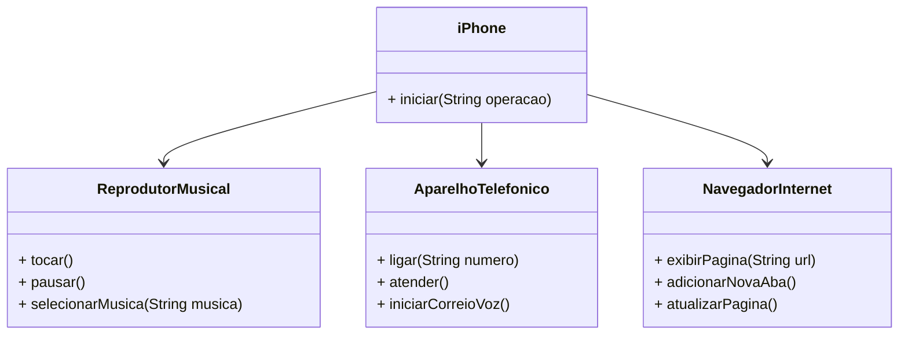

## Desafio POO
O desafio consiste em criar uma UML e implementar em Java. A UML criada está logo abaixo:

```mermaid
classDiagram
    class ReprodutorMusical {
        + tocar()
        + pausar()
        + selecionarMusica(String musica)
    }

    class AparelhoTelefonico {
        + ligar(String numero)
        + atender()
        + iniciarCorreioVoz()
    }

    class NavegadorInternet {
        + exibirPagina(String url)
        + adicionarNovaAba()
        + atualizarPagina()
    }

    class iPhone {
        + iniciar(String operacao)
    }

    iPhone --> ReprodutorMusical
    iPhone --> AparelhoTelefonico
    iPhone --> NavegadorInternet
```